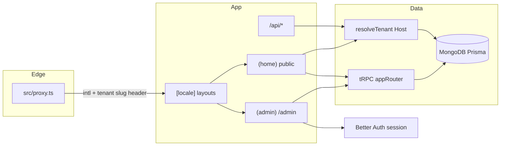

# Architecture

How this Next.js 16 App Router app is put together. Implementation details for auth, CV PDF, ATS tailor, and tenant BYOK live in the sibling docs linked from the [README](../README.md).

## Request path

- **`src/proxy.ts`** (Next middleware): next-intl routing, legacy process-page redirects, `x-tenant-username` from **Host** for document requests. Matcher **excludes** `/api/*`.
- **Tenant identity:** `src/lib/tenant/parse-host.ts` + `resolve-identity.ts`. Subdomain → that profile. Apex → primary owner. Client `x-tenant-username` is ignored unless PDF generation sends a HMAC (`docs/cv-pdf.md`, `docs/security.md`).
- **Admin:** `src/app/[locale]/(admin)/admin/layout.tsx` requires a session; tRPC mutations use `protectedProcedure` and `ctx.user.id`.
- **Public CMS data:** `publicProcedure` / `tenantProcedure` scoped to `ctx.tenant.userId` from Host.

## Feature modules

Code lives under `src/features/<name>/` (UI, lib, server routers). App Router pages in `src/app/[locale]/` stay thin.

| Area | Public | Admin |
| --- | --- | --- |
| Profile / hero / about | `(home)` | `/admin/profile` |
| Skills, projects, certs, timeline, services, soft skills | matching routes | `/admin/<resource>` |
| CV | `/curriculum-vitae`, `/api/cv/pdf`, `/api/cv/docx` | `/admin/cv` |
| Process pages | `/process/...` | `/admin/process-pages` |
| Now / Uses / colophon / stats | gated by `PUBLIC_PAGE_LIVE` | `/admin/now`, `/admin/uses` |
| Job Tracker + Resume Engine | — | `/admin/job-tracker`, resume workflows |
| Integrations | Spotify widget, contact mail | `/admin/credentials` |
| Analytics | beacon + `/stats` | dashboard cards |

tRPC assembly: `src/server/api/root.ts`. Context (`src/server/api/trpc.ts`) always loads session + tenant.

Deeper guides: [`admin-cms.md`](./admin-cms.md), [`job-tracker.md`](./job-tracker.md), [`public-pages.md`](./public-pages.md), [`i18n.md`](./i18n.md), [`seed-and-export.md`](./seed-and-export.md).

## Data

- **Prisma schema:** `prisma/schema/` (MongoDB). Push with `pnpm db:push` (no SQL migrations).
- **Seed fixtures:** `prisma/data/*.json` + `prisma/seed*.ts`.
- **i18n messages:** `messages/en.json` (source), `es.json`, `nl.json`. Parity is tested.

## Auth and email

- Better Auth at `/api/auth/[...all]` (`src/lib/auth.ts`).
- System Resend (reset / 2FA) vs tenant Resend (contact / CV / job mail): `docs/tenant-credentials.md`.

## Hosting notes

- Vercel serverless. Playwright CV PDF is isolated in `/api/internal/cv/generate-pdf` so the rest of the app does not trace Chromium (`next.config.ts` `outputFileTracingIncludes`).
- Images: stored values must be local `/` paths or absolute HTTPS URLs (`docs/media.md`). `next/image` allows `https://**` for tenant CDNs.
