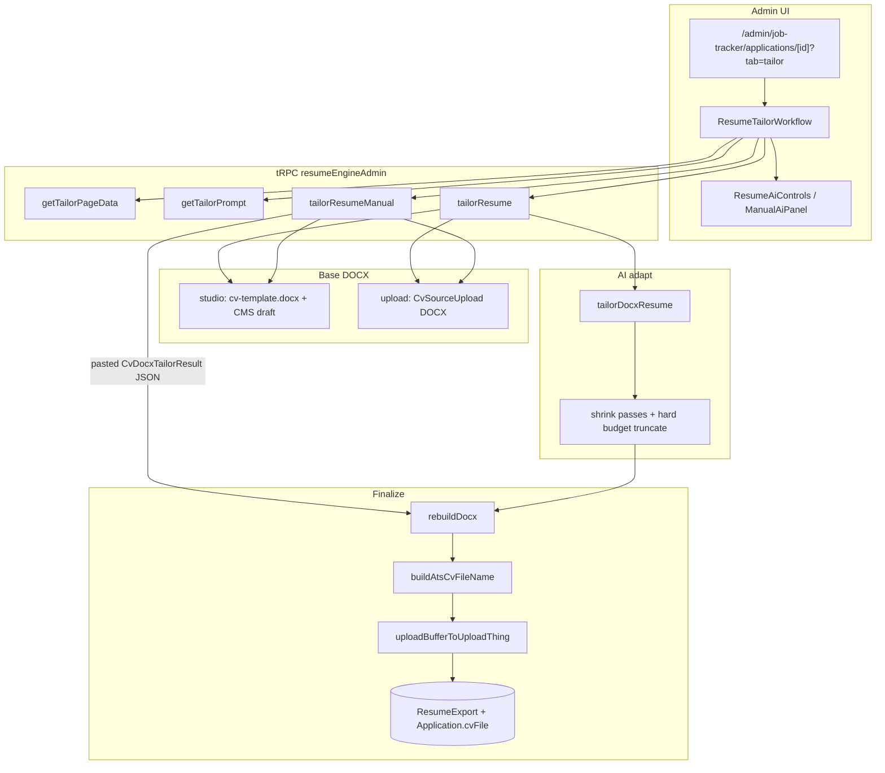

# ATS Tailored CV Generator

How the admin **Resume Engine** adapts a DOCX CV to a job description (ATS-oriented export), uploads it, and optionally attaches it to a Job Tracker application.

This is **not** the public portfolio PDF/DOCX download (`docs/cv-pdf.md`, `/api/cv/pdf`, `/api/cv/docx`). Those serve the CMS CV for visitors. ATS tailor is an **admin-only** pipeline: tRPC → AI → layout-preserving DOCX rebuild → UploadThing → `ResumeExport` / `Application.cvFile`.

---

## Goals

1. **Layout stability** — adapt run text inside an existing DOCX template (or uploaded DOCX); do not regenerate layout from scratch on the live path.
2. **JD fit** — rewrite bullets/summary for the job description while preserving facts and the candidate’s real title.
3. **Organized exports** — ATS-safe filenames: name + role + company + locale.
4. **Job Tracker link** — when run from an application, overwrite `Application.cvFile` with the latest tailored file.

---

## Overview



---

## User flow (product path)

1. Open an application:  
   `src/app/[locale]/(admin)/admin/job-tracker/applications/[id]/page.tsx`  
   URL query: `?tab=tailor`.
2. `ApplicationDetailView` embeds `ResumeTailorWorkflow`  
   (`src/features/job-tracker/components/application-detail-view.tsx`).
3. Choose source:
   - **Studio** — CMS structured draft injected into `cv-template.docx`.
   - **Upload** — previously registered DOCX (`CvSourceUpload`).
4. Paste / confirm job description (often prefilled from `Application.description`).
5. Run **auto** (AI provider) or **manual** (copy prompt → paste JSON).
6. Server rebuilds DOCX, uploads, creates `ResumeExport`, updates `Application.cvFile`.
7. Detail view shows the downloadable CV name/URL.

Resume Studio / import (feeds studio content) lives under admin CV:

- `src/app/[locale]/(admin)/admin/cv/cv-editor.tsx`
- `src/features/resume-engine/components/resume-import-workflow.tsx`

---

## Source modes

| Mode | Base DOCX | Content facts |
|------|-----------|---------------|
| `studio` | `src/features/resume-engine/assets/cv-template.docx` via `loadCvTemplateForTailor()` | CMS draft from `resolveTailorBaseDraft()` / `loadCvStructuredDraft` |
| `upload` | File at `CvSourceUpload.originalFileUrl` via `fetchUploadDocxForTailor()` | Existing DOCX text adapted in place |

Both paths end in the same finalize: `finalizeDocxTailorExport` → `rebuildDocx` → persist.

> Note: `finalizeTailorExport` (structured → `generateDocxFromStructured`) still exists in `finalize-tailor-export.ts` but is **not** used by the current router. Live tailor always uses the DOCX rebuild path.

---

## File map (paths)

### UI

| Path | Role |
|------|------|
| `src/features/resume-engine/components/resume-tailor-workflow.tsx` | Main wizard (configure → running → done) |
| `src/features/resume-engine/components/resume-ai-controls.tsx` | Auto / manual + provider picker |
| `src/features/resume-engine/components/manual-ai-panel.tsx` | Prompt + JSON paste for manual mode |
| `src/features/resume-engine/components/resume-docx-upload.tsx` | Upload DOCX for upload-source mode |
| `src/features/resume-engine/components/resume-import-workflow.tsx` | Import into Resume Studio |
| `src/features/job-tracker/components/application-detail-view.tsx` | Hosts tailor tab; shows `cvFile` |
| `src/features/job-tracker/components/application-card.tsx` | Shows attached CV name on cards |
| `src/app/[locale]/(admin)/admin/job-tracker/applications/[id]/page.tsx` | Application page (`tab=tailor\|timeline\|details`) |
| `src/app/[locale]/(admin)/admin/cv/cv-editor.tsx` | Resume Studio / import |

### tRPC / server

| Path | Role |
|------|------|
| `src/features/resume-engine/server/resume-engine-admin.router.ts` | `getTailorPageData`, `getTailorPrompt`, `tailorResume`, `tailorResumeManual`, `registerUpload`, … |
| `src/features/job-tracker/server/job-tracker-admin.router.ts` | Application CRUD (optional `cvFile`) |
| `src/features/job-tracker/server/job-tracker-queries.ts` | Application detail data |
| `src/server/api/root.ts` | Registers `resumeEngineAdmin`, `jobTrackerAdmin` |

### AI

| Path | Role |
|------|------|
| `src/features/resume-engine/lib/ai/docx-tailor-prompt.ts` | DOCX / studio / shrink system prompts |
| `src/features/resume-engine/lib/ai/prompt-package.ts` | Builds system + user prompt packages |
| `src/features/resume-engine/lib/ai/tailor-docx.ts` | Provider call, shrink loop, `tailorDocxResume` |
| `src/features/resume-engine/lib/ai/providers.ts` | Available providers, models, `resolveAiProvider` |
| `src/features/resume-engine/lib/ai/provider-types.ts` | Provider name types |
| `src/features/resume-engine/lib/ai/parse-json-response.ts` | Strip fences / parse AI JSON |
| `src/features/resume-engine/lib/ai/shrink-result.ts` | Shrink-pass Zod schema |
| `src/features/resume-engine/lib/cv-docx-tailor-result.ts` | `CvDocxTailorResult` Zod schema |
| `src/features/resume-engine/lib/ai/tailor-prompt.ts` | Legacy structured-draft prompt (not live router) |
| `src/features/resume-engine/lib/ai/tailor-structured.ts` | Legacy structured tailor (not live router) |
| `src/features/resume-engine/lib/ai/import-prompt.ts` | Import extract prompt |
| `src/features/resume-engine/lib/ai/extract-structured.ts` | AI import parse |

### DOCX parse / rebuild / template

| Path | Role |
|------|------|
| `src/lib/docx/parser.ts` | `parseDocx` → sections, raw XML, zip |
| `src/lib/docx/rebuilder.ts` | `rebuildDocx` — write adapted run text back into `document.xml` |
| `src/lib/types.ts` | `CvSection`, `AdaptedSection`, etc. |
| `src/features/resume-engine/assets/cv-template.docx` | Studio tailor template |
| `src/features/cv/lib/load-cv-template-docx.ts` | Load + parse template |
| `src/features/resume-engine/lib/fetch-upload-docx.ts` | Fetch + parse uploaded DOCX |
| `src/features/resume-engine/lib/resolve-tailor-base-draft.ts` | Resolve CMS or upload draft |
| `src/features/resume-engine/lib/docx/generate-from-structured.ts` | Generate DOCX from structured draft (public DOCX / unused finalize path) |
| `src/features/resume-engine/lib/docx/import-parser.ts` | Import-oriented parse |

### Finalize, filename, upload

| Path | Role |
|------|------|
| `src/features/resume-engine/lib/finalize-tailor-export.ts` | `finalizeDocxTailorExport`, `persistResumeExport`, unused `finalizeTailorExport` |
| `src/features/resume-engine/lib/build-ats-cv-file-name.ts` | ATS filename helpers |
| `src/lib/uploadthing/upload-buffer.ts` | `uploadBufferToUploadThing` |
| `src/lib/uploadthing/tenant-uploadthing.ts` | Per-tenant UT client / config |
| `src/app/api/uploadthing/route.ts` | UploadThing HTTP handler |
| `src/app/api/uploadthing/core.ts` | File router (incl. resume importer) |
| `src/features/integrations/server/integrations-admin.router.ts` | `uploadFile` used by DOCX upload UI |

### Prisma

| Path | Role |
|------|------|
| `prisma/schema/resume-engine.prisma` | `CvSourceUpload`, `ResumeExport` |
| `prisma/schema/job-tracker.prisma` | `Application`, embedded `CvFile`, `resumeExports` |
| `src/features/job-tracker/lib/application-editor-dto.ts` | Maps `cvFile` for UI |

### Related public routes (not ATS tailor)

| Path | Role |
|------|------|
| `src/app/api/cv/docx/route.ts` | Public portfolio DOCX |
| `src/app/api/cv/pdf/route.ts` | Public portfolio PDF — see `docs/cv-pdf.md` |

---

## Key procedures & functions

### Router (`resume-engine-admin.router.ts`)

| Procedure | What it does |
|-----------|----------------|
| `getTailorPageData` | Studio preview, recent uploads, application JD/company for the wizard |
| `getTailorPrompt` | Builds copyable prompt package for manual mode |
| `tailorResume` | Auto AI → `finalizeDocxTailorExport` |
| `tailorResumeManual` | Parse pasted `CvDocxTailorResult` JSON → same finalize |
| `registerUpload` | Persists `CvSourceUpload` after client upload |

Locale helper in the same file: `detectLocaleFromJobDescription` (heuristic `en` / `es` / `nl` from JD keywords).

### Pipeline helpers

| Function | File | Role |
|----------|------|------|
| `tailorDocxResume` | `lib/ai/tailor-docx.ts` | Call provider; shrink overflows; hard-truncate to run budgets |
| `buildDocxTailorPromptPackage` / `buildStudioDocxTailorPromptPackage` | `lib/ai/prompt-package.ts` | System + user prompts with per-run `budget` |
| `parseDocx` | `src/lib/docx/parser.ts` | Extract adaptable sections |
| `rebuildDocx` | `src/lib/docx/rebuilder.ts` | Apply adapted texts; localize static headings; return `Buffer` |
| `loadCvTemplateForTailor` | `src/features/cv/lib/load-cv-template-docx.ts` | Read template asset |
| `fetchUploadDocxForTailor` | `lib/fetch-upload-docx.ts` | Download + parse upload |
| `resolveTailorBaseDraft` | `lib/resolve-tailor-base-draft.ts` | CMS draft for studio path |
| `finalizeDocxTailorExport` | `lib/finalize-tailor-export.ts` | Rebuild → persist |
| `persistResumeExport` | same | Filename → UploadThing → DB |
| `buildAtsCvFileName` / `inferCvRoleTrack` / `atsPersonNameFromFullName` | `lib/build-ats-cv-file-name.ts` | Export naming |
| `uploadBufferToUploadThing` | `src/lib/uploadthing/upload-buffer.ts` | Tenant UT upload |

---

## Inputs / outputs

### `tailorResume` / `tailorResumeManual` input

| Field | Type | Notes |
|-------|------|--------|
| `sourceType` | `"studio" \| "upload"` | Required |
| `uploadId` | `string?` | Required when `sourceType === "upload"` |
| `jobDescription` | `string` (min 20) | Trimmed; UI may fall back to `Application.description` |
| `applicationId` | `string?` | Links export + updates `cvFile` |
| `provider` | `claude \| openai \| deepseek \| gemini` | Auto mode |
| `targetLocale` | `en \| es \| nl` | Optional |
| `tailoredFor` | `string?` | Label; else `"{position} @ {company}"` |
| `rawJson` | `string` | Manual mode only |

### AI result (`CvDocxTailorResult`)

Defined in `src/features/resume-engine/lib/cv-docx-tailor-result.ts`:

```ts
{
  detectedLocale: "en" | "es" | "nl";
  sections: AdaptedSection[]; // same section/paragraph/run ids; text only
  aiScore: number;            // 0–100
  matchNotes?: string;
}
```

### Mutation return (typical)

`{ export, downloadUrl, aiScore, matchNotes, provider }` after persist.

### Locale resolution (priority)

1. AI `detectedLocale` (when present)
2. Explicit `targetLocale`
3. Studio draft `detectedLocale` / JD heuristic
4. Default `"en"`

### Full name for filename

Draft/snapshot header → else `cvHeader.fullName` → else `"Candidate"`  
(`resolveExportFullName` in `finalize-tailor-export.ts`).

---

## Filename convention

Implemented in `src/features/resume-engine/lib/build-ats-cv-file-name.ts`.

**Pattern**

```text
{PersonName} - {RoleTrack} Developer - {Company?} - {LOCALE}.docx
```

**Examples**

| Case | Filename |
|------|----------|
| Tailored for Nisum (ES) | `Jesus Hernandez - Fullstack Developer - Nisum - ES.docx` |
| Backend + company | `Jesus Hernandez - Backend Developer - Imagemaker - ES.docx` |
| No company | `Jesus Hernandez - Fullstack Developer - EN.docx` |

**Rules**

- `stripForAtsFileName` — NFD strip diacritics; keep ASCII letters/digits/spaces/hyphens.
- `atsPersonNameFromFullName` — given name + paternal surname (LatAm-style).  
  Example: `Jesús Enmanuel Hernández González` → `Jesus Hernandez`  
  (first token + second-to-last when there are 3+ tokens; avoids using the middle given name as “surname”).
- `inferCvRoleTrack` — scans `position + tailoredFor + jobDescription` → `Frontend` | `Backend` | `Fullstack` (default Fullstack). Label becomes `{track} Developer`.
- Company — from linked `Application.company.name` when `applicationId` resolves; omitted from the filename when empty.
- Locale — uppercased (`ES`, `EN`, `NL`).

Tests: `src/features/resume-engine/lib/build-ats-cv-file-name.test.ts`.

---

## Persistence model

### `ResumeExport` (`prisma/schema/resume-engine.prisma`)

Immutable tailored DOCX record: `fileName`, `fileUrl`, `uploadThingKey`, `mimeType`, `sourceType`, `sourceUploadId?`, `tailoredFor?`, `jobDescription?`, `aiScore?`, `aiProvider?`, `structuredSnapshot?`, `applicationId?`.

### `Application.cvFile` (`prisma/schema/job-tracker.prisma`)

Embedded composite `{ name, url, uploadedAt }`. **Overwritten** when a tailor run includes that `applicationId` (latest wins).

### `CvSourceUpload`

Original uploaded DOCX metadata + optional `parsedDraft` for import/studio.

---

## AI providers & env

Configured via `src/env.ts` / credentials:

| Variable / source | Use |
|-------------------|-----|
| `ANTHROPIC_API_KEY` | Claude |
| `OPENAI_API_KEY` | OpenAI |
| `DEEPSEEK_API_KEY` | DeepSeek (`https://api.deepseek.com`) |
| `GEMINI_API_KEY` | Gemini |
| `DEFAULT_AI_PROVIDER` | Optional default |
| UploadThing | **Tenant** Admin → Credentials (`uploadthing` integration). Export upload does not rely on a global env fallback. |

If no AI keys are available, auto mode is unavailable; **manual JSON** still works (`aiProvider: "manual"`).

Models (`AI_PROVIDER_MODELS` in `providers.ts`):

| Provider | Model |
|----------|--------|
| claude | `claude-sonnet-4-5` |
| openai | `gpt-4o` |
| deepseek | `deepseek-chat` |
| gemini | `gemini-2.0-flash` |

Packages: `@anthropic-ai/sdk`, `openai`, `@google/genai`, `uploadthing`, `@uploadthing/react`.

---

## Locked dates / company lines

Company–location–date lines (e.g. `Imagemaker · Remote · August 2025 – Present`) and education year lines are **intentionally not sent to the AI** (they contain `·` / year-only patterns). Historically that meant the baked-in `cv-template.docx` dates survived every export.

On finalize (studio / any path with a structured draft snapshot), those **locked** paragraphs are synced from the CMS draft before `rebuildDocx`:

| Path | Role |
|------|------|
| `src/lib/docx/parser.ts` | Collects `lockedParagraphs` (`experience-meta`, `experience-role`, `education-dates`) |
| `src/features/resume-engine/lib/sync-locked-paragraphs-from-draft.ts` | Builds updated texts from draft experiences/education |
| `src/features/resume-engine/lib/finalize-tailor-export.ts` | Merges locked adaptations into rebuild |
| `src/features/cv/lib/generate-cv-docx-from-db.ts` | Same sync for portfolio DOCX-from-DB |

Experience meta format: `{company} · {location} · {formatted dates}` (preserves client annotations when the draft company is a prefix of the template company). Role lines like `Full-time | …` keep the employment-type prefix and take the draft role.

---

## Shrink / budget behavior

After the main tailor call (`tailorDocxResume`):

1. Up to **2 shrink API passes** if adapted run text exceeds original budgets.
2. Then **hard truncate** to original run budgets so page count / layout stay stable.

Prompt packages include per-run `budget` so the model knows length limits up front (`prompt-package.ts`, `docx-tailor-prompt.ts`).

---

## Tests

| Path | Coverage |
|------|----------|
| `src/features/resume-engine/lib/build-ats-cv-file-name.test.ts` | Name stripping, ATS filename, role-track inference |
| `src/features/resume-engine/lib/sync-locked-paragraphs-from-draft.test.ts` | CMS date/company/role sync into locked lines |
| `src/lib/docx/docx.test.ts` | Parse / rebuild round-trip; template locked paragraphs |
| `src/lib/docx/xml-text.test.ts` | XML text helpers |
| `src/features/resume-engine/components/resume-import-workflow.test.tsx` | Import UI |
| `e2e/cv-import-tailor.spec.ts` | Light admin CV import/preview smoke (not full tailor → UT → `cvFile` E2E) |

---

## Architecture notes

1. **ATS tailor ≠ public CV download.** Public `/api/cv/*` serves the portfolio CV; ATS is admin tRPC + UploadThing + optional Job Tracker attach.
2. **Studio path** injects CMS facts into `cv-template.docx` run slots, then adapts for the JD.
3. **Upload path** adapts the user’s own DOCX in place (same id/budget rules).
4. **Complementary bullets / company blurbs** — each experience can store `companyBlurb` and `atsOnly` responsibilities. Public/printed CV shows only non-`atsOnly` bullets; the studio tailor draft includes `atsResponsibilities` + `companyBlurb` as a factual bank (see `cv-import-draft.ts`, `load-cv-structured-draft.ts`, `docx-tailor-prompt.ts`).
5. **Job Tracker link is optional** but is the intended product path: application → Tailor tab → export lands on `Application.cvFile` and `ResumeExport`.
6. Prompts must preserve the candidate’s real professional title/degree (see system prompts in `docx-tailor-prompt.ts`).

---

## Quick debug checklist

1. Confirm UploadThing tenant credentials are connected (Admin → Credentials).
2. Confirm at least one AI key for auto mode, or use manual JSON.
3. Studio: ensure Resume Studio / CMS draft has `header.fullName` (drives filename).
4. Upload: ensure `registerUpload` created a `CvSourceUpload` and `uploadId` is passed.
5. Filename wrong? Check `build-ats-cv-file-name.ts` + full name resolution in `finalize-tailor-export.ts`.
6. Dates/company lines stale? Confirm CMS experience `startDate`/`endDate`/`current` (and education years or `dates`) and that `structuredSnapshot` is passed into `finalizeDocxTailorExport`. See **Locked dates / company lines**.
7. Layout broken / overflow? Inspect shrink logs in `tailor-docx.ts` and run budgets from parse.
