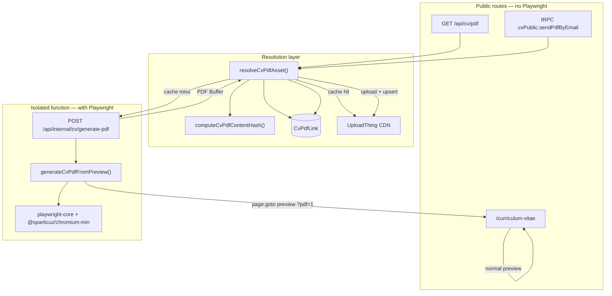

# CV PDF — Technical Guide

This document describes how CV PDF generation, caching, and delivery work in the multi-tenant portfolio. UploadThing and portfolio CV email use **each tenant’s own credentials** (Admin → Credentials), not platform env keys — see [`tenant-credentials.md`](./tenant-credentials.md).

The design goals are:

1. **Visual fidelity** — the PDF must match the web preview (`/curriculum-vitae`), not an external Word template.
2. **Smart caching** — do not regenerate on every request; invalidate automatically when CV content changes.
3. **Vercel isolation** — Playwright/Chromium lives only in a dedicated serverless function to avoid bundle limits (250 MB) and file tracing errors.

---

## Overview



---

## User flows

### Public download

1. The visitor opens `/curriculum-vitae`.
2. The download button points to `GET /api/cv/pdf?locale={locale}&paginate=0|1`.
3. The route resolves the tenant, calls `resolveCvPdfAsset()`, and:
   - **Cache hit** → `302` redirect to the UploadThing URL.
   - **Cache miss** → generates via the internal function, uploads to UploadThing, saves to DB, then redirects or streams.
   - **No UploadThing** → returns the PDF buffer directly (dev only).

### Email delivery

1. The visitor uses the form in `CvPageActions` (client).
2. It calls `cvPublic.sendPdfByEmail` (tRPC).
3. Rate limits are applied (`CvPdfEmailLog`).
4. The same `resolveCvPdfAsset()` runs with `includeBuffer: true`.
5. Resend attaches the PDF and notifies the owner.

### Playwright preview (`?pdf=1`)

When Playwright generates the PDF, it does not render HTML in memory — it **navigates to the real web preview**.

| Locale | URL visited by Chromium |
| --- | --- |
| `en`, `es`, `nl` | `{getServerBaseUrl()}/{locale}/curriculum-vitae?pdf=1` |

`getServerBaseUrl()` comes from `BETTER_AUTH_URL` / `VERCEL_URL` / localhost — **not** from the JSON body. The internal route does not accept `baseUrl` (SSRF).

The `pdf=1` query param enables `pdfMode` in `CvPageView` (preview only, no chrome). Middleware (`src/proxy.ts`) sets `x-cv-pdf-mode: 1` for document requests.

On apex/preview hosts without a tenant subdomain, Chromium also sends:

- `x-tenant-username: {slug}`
- `x-cv-pdf-tenant-proof: HMAC-SHA256(slug, CV_PDF_GENERATOR_SECRET)`

`resolveTenant` honors the username header **only** when that HMAC matches. Collect and public tRPC never take an unsigned username header.

Playwright injects reset CSS (`PDF_RESET_CSS` in `generate-cv-pdf-from-preview.ts`) and calculates content height before calling `page.pdf()`.

---

## Cache layer — `resolveCvPdfAsset`

**File:** `src/features/cv/lib/resolve-cv-pdf-asset.ts`

Single entry point for download and email. All cache logic lives here.

### Algorithm

```
1. loadCvPreviewSnapshot(userId, locale)  → rendered CV snapshot
2. contentHash = SHA-256({ paginatePages, snapshot })
3. Look up CvPdfLink by (userId, locale, paginatePages)
4. If contentHash matches stored value → cache hit (fetch/redirect CDN)
5. If legacy manual URL (contentHash = null) → use without hash validation
6. Otherwise → requestCvPdfGeneration() → upload UploadThing → upsert CvPdfLink
```

### Why the hash fixes stale PDFs

The historical problem was storing a **fixed URL** (Cloudinary, Drive, admin settings) that was never invalidated when the CV was edited. The preview read live DB data; the PDF stayed outdated.

With `contentHash`:

| Event                             | Result                                                 |
| --------------------------------- | ------------------------------------------------------ |
| CV unchanged                      | Same hash → serve cache                                |
| CV edited                         | Different hash → regenerate and replace on UploadThing |
| Manual URL (`contentHash = null`) | Served as-is (legacy; may become stale)                |

### Snapshot included in the hash

**File:** `src/features/cv/lib/load-cv-preview-snapshot.ts`

Everything that affects the PDF for a given locale is serialized:

- Header (name, title, photos, hero summary, alt text)
- About me (resolved per locale)
- Contacts, education, languages, technical skills
- Experience (role, responsibilities, linked skills)
- Soft skills, additional information

**File:** `src/features/cv/lib/compute-cv-pdf-content-hash.ts`

```ts
SHA - 256(JSON.stringify({ paginatePages, snapshot }));
```

Tests: `src/features/cv/lib/compute-cv-pdf-content-hash.test.ts`

---

## Data model — `CvPdfLink`

**Schema:** `prisma/schema/main.prisma`

| Field           | Type      | Description                                             |
| --------------- | --------- | ------------------------------------------------------- |
| `userId`        | ObjectId  | CV owner                                                |
| `locale`        | string    | `en`, `es`, `nl`                                        |
| `paginatePages` | boolean   | `false` = continuous page; `true` = paginated US Letter |
| `url`           | string    | Public PDF URL (UploadThing CDN)                        |
| `contentHash`   | string?   | Content hash; `null` = legacy manual URL                |
| `storageKey`    | string?   | UploadThing key for deletion on regenerate              |
| `generatedAt`   | DateTime? | Last automatic generation                               |
| `label`         | string?   | Optional label (admin)                                  |

**Constraint:** `@@unique([userId, locale, paginatePages])`

There are **two PDF variants per locale** if both pagination modes are used.

### Migration

```bash
pnpm db:push
pnpm prisma generate
```

---

## Playwright generation

**File:** `src/features/cv/lib/generate-cv-pdf-from-preview.ts`

### Production dependencies

| Package                       | Purpose                                         |
| ----------------------------- | ----------------------------------------------- |
| `playwright-core@^1.61`       | Headless browser API (no bundled Chromium)      |
| `@sparticuz/chromium-min@149` | Serverless Chromium (~46 KB npm; remote binary) |

`@playwright/test` lives in devDependencies for E2E only; it is not used in production.

### Chromium on Vercel vs local

| Environment             | Launch                                                              |
| ----------------------- | ------------------------------------------------------------------- |
| **Vercel** (`VERCEL=1`) | `@sparticuz/chromium-min` downloads the pack from GitHub at runtime |
| **Local**               | `playwright.executablePath()` or `CHROME_LOCAL_PATH`                |

Default pack (`src/features/cv/lib/chromium-pack-url.ts`):

```
https://github.com/Sparticuz/chromium/releases/download/v149.0.0/chromium-v149.0.0-pack.x64.tar
```

Optional override: `CHROMIUM_PACK_URL`

Locally, install Chromium for E2E/PDF:

```bash
npx playwright install chromium
```

### PDF modes

| `paginatePages`   | Behavior                                                 |
| ----------------- | -------------------------------------------------------- |
| `false` (default) | Single continuous page; fixed width `CV_LETTER_WIDTH_PX` |
| `true`            | `Letter` format, US pagination                           |

---

## Isolated internal function

Playwright is **not** imported in tRPC or `/api/cv/pdf`. Only in:

```
POST /api/internal/cv/generate-pdf
```

**File:** `src/app/api/internal/cv/generate-pdf/route.ts`

| Config        | Value                                             |
| ------------- | ------------------------------------------------- |
| `runtime`     | `nodejs`                                          |
| `maxDuration` | `60`                                              |
| Auth          | `Authorization: Bearer {CV_PDF_GENERATOR_SECRET}` |

### HTTP client

**File:** `src/features/cv/lib/request-cv-pdf-generation.ts`

Public routes call the internal function via `fetch`. They do not import Playwright directly.

**Important — base URL for internal calls:**

**File:** `src/lib/url/get-base-url.ts`

| Function                      | Use                                            |
| ----------------------------- | ---------------------------------------------- |
| `getServerBaseUrl()`          | Public site URL (Playwright `page.goto`, auth) |
| `getInternalServiceBaseUrl()` | Server-to-server calls to the internal API     |

Outside Vercel, `getInternalServiceBaseUrl()` **always** uses `http://127.0.0.1:{PORT}`. This prevents `BETTER_AUTH_URL=https://jesushg.com` in `.env.local` from routing internal calls to production during `pnpm start`.

---

## Next.js / Vercel configuration

**File:** `next.config.ts`

### Issue: missing `browsers.json`

Since Playwright 1.60, `browsers.json` is loaded via dynamic `require`. Vercel's file tracer (`@vercel/nft`) does not detect it and deploy fails with:

```
Cannot find module '.../playwright-core/browsers.json'
```

**Fix:** `outputFileTracingIncludes` on the **internal route only**.

### Issue: 250 MB function limit

The full `@sparticuz/chromium` package (~133 MB) exceeded the limit. We use `@sparticuz/chromium-min`, which downloads the binary at runtime.

### Bundle isolation

```ts
outputFileTracingIncludes: {
  "/api/internal/cv/generate-pdf": playwrightServerAssets,
},
outputFileTracingExcludes: {
  "/api/trpc/*": playwrightExcludeAssets,
  "/api/cv/pdf": playwrightExcludeAssets,
},
serverExternalPackages: ["playwright-core", "@sparticuz/chromium-min"],
```

Post-build verification:

```bash
node -e "
for (const r of ['api/trpc/[trpc]/route.js','api/internal/cv/generate-pdf/route.js']) {
  const f = require('./.next/server/app/' + r + '.nft.json');
  const n = f.files.filter(x => x.includes('playwright') || x.includes('sparticuz')).length;
  console.log(r, n);
}"
# Expected: trpc → 0, internal → ~272
```

---

## Environment variables

| Variable                  | Required    | Description                                                       |
| ------------------------- | ----------- | ----------------------------------------------------------------- |
| `CV_PDF_GENERATOR_SECRET` | Yes (prod)  | Secret ≥16 chars; Bearer auth for `/api/internal/cv/generate-pdf` |
| `UPLOADTHING_TOKEN`       | Yes (prod)  | Upload and CDN cache                                              |
| `BETTER_AUTH_URL`         | Recommended | Public site URL (Playwright navigates here)                       |
| `CHROMIUM_PACK_URL`       | No          | Override Sparticuz pack tar URL                                   |
| `CHROME_LOCAL_PATH`       | No          | Explicit Chromium path in dev                                     |
| `VERCEL`                  | Auto        | Set by Vercel; enables chromium-min                               |

### Example `.env.local`

```env
CV_PDF_GENERATOR_SECRET=dev-secret-min-16-chars
UPLOADTHING_TOKEN=...
BETTER_AUTH_URL=http://localhost:3000
```

Configure the same variables in the Vercel project dashboard for production.

---

## APIs and routers

### HTTP routes

| Route                           | Method | Playwright | Description                                |
| ------------------------------- | ------ | ---------- | ------------------------------------------ |
| `/api/cv/pdf`                   | GET    | No         | Public download; redirect to CDN or stream |
| `/api/internal/cv/generate-pdf` | POST   | Yes        | Isolated generation (internal use only)    |

### tRPC

| Procedure                       | Router                | Description                              |
| ------------------------------- | --------------------- | ---------------------------------------- |
| `cvPublic.sendPdfByEmail`       | `cv-public.router.ts` | Email with PDF attachment                |
| `cvPublic.getPdfDeliveryStatus` | `cv-public.router.ts` | `{ canSendByEmail, hasCvData }`          |
| `cv.regeneratePdfCache`         | `cv.router.ts`        | Force regeneration (authenticated admin) |
| `cv.upsertPdfLink`              | `cv.router.ts`        | Manual URL; clears `contentHash`         |
| `cv.getPdfLinks`                | `cv.router.ts`        | List links per locale                    |

### Rate limiting (email)

**File:** `src/features/cv/lib/rate-limit-cv-email.ts`

| Limit                        | Value |
| ---------------------------- | ----- |
| Per IP / hour / tenant       | 3     |
| Per recipient / day / tenant | 5     |

Logs stored in `CvPdfEmailLog`.

---

## File map

```
src/
├── app/
│   ├── api/
│   │   ├── cv/pdf/route.ts              # Public download
│   │   └── internal/cv/generate-pdf/route.ts  # Isolated Playwright
│   └── [locale]/(home)/curriculum-vitae/
│       ├── page.tsx                     # ?pdf=1 → pdfMode
│       └── cv-page-view.tsx             # Preview + actions
├── features/cv/
│   ├── lib/
│   │   ├── compute-cv-pdf-content-hash.ts
│   │   ├── load-cv-preview-snapshot.ts
│   │   ├── resolve-cv-pdf-asset.ts      # Main orchestrator
│   │   ├── request-cv-pdf-generation.ts # HTTP client → internal function
│   │   ├── generate-cv-pdf-from-preview.ts
│   │   ├── get-cv-pdf-download.ts
│   │   └── chromium-pack-url.ts
│   ├── server/
│   │   ├── cv-public.router.ts
│   │   └── cv.router.ts
│   └── components/cv-page-actions.tsx
├── lib/url/get-base-url.ts
└── proxy.ts                             # x-cv-pdf-mode header
prisma/schema/main.prisma                # CvPdfLink, CvPdfEmailLog
next.config.ts                           # Playwright file tracing
```

---

## Troubleshooting

### `Cannot find module .../browsers.json` in tRPC

**Cause:** Playwright included in the `/api/trpc/*` bundle (old deploy or incorrect tracing).

**Fix:** Verify `outputFileTracingIncludes` points **only** to `/api/internal/cv/generate-pdf` and redeploy.

### `The Vercel Function exceeds 250mb`

**Cause:** Full `@sparticuz/chromium` in the bundle.

**Fix:** Use `@sparticuz/chromium-min` + remote pack. Playwright only on the internal route.

### PDF outdated compared to preview

**Probable cause:** Manual URL in admin (`contentHash = null`) or cache without invalidation.

**Fix:** Use automatic generation (let `resolveCvPdfAsset` regenerate) or call `cv.regeneratePdfCache`.

### Local error with `pnpm build && pnpm start`

1. Verify `CV_PDF_GENERATOR_SECRET` in `.env.local`.
2. Verify internal calls go to `127.0.0.1:3000`, not production.
3. Install Chromium: `npx playwright install chromium`.

### Slow cold start on Vercel (first generation)

Expected: `@sparticuz/chromium-min` downloads ~68 MB from the pack on first invocation. Subsequent warm starts reuse `/tmp/chromium`. With UploadThing cache, most requests never reach Playwright.

### `CV_PDF_GENERATOR_SECRET is not configured`

Add the variable in `.env.local` (dev) or Vercel (prod). Minimum 16 characters.

---

## Common operations

### Force regeneration (admin)

```ts
// tRPC from authenticated dashboard
await trpc.cv.regeneratePdfCache.mutate({
  locale: "en",
  paginatePages: false,
});
```

### Verify hash after editing CV

1. Edit a CV section in admin.
2. Download PDF → should regenerate (first download slower).
3. Second download → instant redirect to CDN.
4. In DB, `CvPdfLink.contentHash` and `generatedAt` updated.

### Deploy checklist

- [ ] `pnpm db:push` applied
- [ ] `CV_PDF_GENERATOR_SECRET` set in Vercel (≥ 16 characters)
- [ ] `BETTER_AUTH_URL` set in Vercel (public HTTPS URL, e.g. `https://jesushg.com`)
- [ ] `UPLOADTHING_TOKEN` set in Vercel
- [ ] Build verifies 0 Playwright files in `/api/trpc/*`
- [ ] Test download and email on preview deployment

---

## Design decisions (reference)

| Decision                    | Rejected alternative       | Reason                                 |
| --------------------------- | -------------------------- | -------------------------------------- |
| Playwright over web preview | Gotenberg / DOCX template  | Fidelity with existing preview         |
| Content hash cache          | Always regenerate          | Cost/latency on Vercel                 |
| `@sparticuz/chromium-min`   | Full `@sparticuz/chromium` | Vercel 250 MB limit                    |
| Dedicated internal function | Playwright in tRPC         | Bundle size + tracing                  |
| UploadThing CDN             | Serve buffer from lambda   | Fast redirect; Playwright off hot path |
