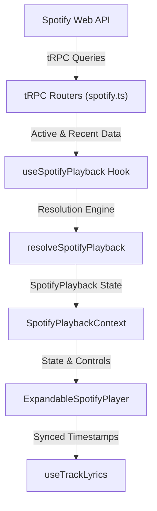

# Spotify Widget Documentation

The Spotify Widget is a real-time, interactive mini-app integrated into the portfolio. It showcases live listening activity, synced lyrics, recent playback history, and iOS-style player controls.

---

## 1. Overview & Architecture

The Spotify Widget follows a domain-driven, component-based architecture located under `@/components/shared/spotify-widget`. It integrates with Spotify's Web API through server-side tRPC endpoints, handling authentication, caching, explicit content filtering, and adaptive polling.



### Component Hierarchy

```
src/components/shared/spotify-widget/
├── expandable-spotify-player.tsx   # Root expandable widget container
├── context/
│   └── spotify-playback-context.tsx# React context supplying playback state & lyrics
├── hooks/
│   ├── use-spotify-playback.ts    # Polling & data orchestration hook
│   ├── use-playback-clock.ts      # Smooth client-side progress tick
│   ├── use-track-lyrics.ts        # Synced lyrics fetching & cache
│   └── use-prefetch-next-lyrics.ts# Next queue track lyrics prefetching
├── utils/
│   ├── resolve-spotify-playback.ts # Resolution engine (active, paused, fallback)
│   ├── playback-mappers.ts        # Data mappers & explicit content filters
│   └── spotify-timing.ts          # Timing & polling interval constants
└── components/
    ├── playing-indicator.tsx      # Cover artwork badge (equalizer / pause icon)
    ├── spotify-now-playing-screen.tsx # Expanded player view
```

### Integration with `ios-device` Custom Library

The Spotify Widget UI is assembled inside our custom-built **iOS Device Simulator & Navigation System** located in `src/components/shared/ios-device/` (detailed in [`docs/ios-device.md`](./ios-device.md) and [`docs/mini-apps-guide.md`](./mini-apps-guide.md)):

- **`<IOSDeviceMockup>`**: Renders realistic iPhone bezels, hardware frame, and safe-area viewports.
- **`<IOSNavigationStack>`**: Manages native 60+ FPS iOS navigation stack transitions (`push` horizontal parallax and `sheet` vertical modal transitions) across the **Now Playing Screen**, **Synced Lyrics Screen**, and **Queue Screen**.
- **`<IOSDynamicIsland>`**: Renders a reactive Live Activity pill showing compact listening status at the top of the simulated screen.
- **`<IOSHomeBar>`**: Renders the bottom home indicator with touch/drag swipe-to-dismiss gestures.

---

## 2. Spotify API Endpoints & Server Layer

Server-side endpoints live in `src/utils/services/spotify.ts` and are exposed via tRPC (`api.spotify.*`):

| Endpoint            | Spotify API URL                         | Purpose                                             |
| ------------------- | --------------------------------------- | --------------------------------------------------- |
| `getNowPlaying`     | `/v1/me/player/currently-playing`       | Fetches active or paused track/episode data         |
| `getQueue`          | `/v1/me/player/queue`                   | Fetches current queue & next upcoming track         |
| `getRecentlyPlayed` | `/v1/me/player/recently-played?limit=3` | Fetches up to 3 recently played tracks for fallback |

> **Note on `limit=3`**: Fetching 3 tracks ensures that if the most recent track is explicit (and thus filtered out), the resolution engine has sufficient history to find the first clean, non-explicit track.

---

## 3. Playback Resolution Engine (`resolveSpotifyPlayback`)

The resolution engine normalizes raw API payloads from active, paused, or idle Spotify sessions into a consistent `SpotifyPlayback` interface:

```typescript
export interface SpotifyPlayback {
  contentId: string;
  snapshotTimestamp: number;
  contentType: "track" | "episode";
  source: "now_playing" | "recently_played";
  title: string;
  subtitle: string;
  primaryArtist: string;
  albumName: string;
  durationMs: number;
  progressMs: number;
  isPlaying: boolean;
  contentUrl: string;
  imageUrl?: string;
  imageAlt?: string;
  previewUrl?: string | null;
  playedAt?: string;
}
```

### Resolution Logic Flow

1. **Active or Paused Playback (`getNowPlaying` status 200)**:
   - If `data.item` is present and **non-explicit**, maps to `source: "now_playing"`.
   - Preserves `isPlaying` (`true` when playing, `false` when paused).
   - If `data.item` is **explicit**, flags `shouldTryRecentlyPlayed = true` (explicit tracks are never rendered on the portfolio).

2. **Idle or Player Stopped (`getNowPlaying` status 204)**:
   - Sets `shouldTryRecentlyPlayed = true`.

3. **Recently Played Fallback (`getRecentlyPlayed`)**:
   - Searches `recentlyPlayedData.items` using `data.items.find(item => item.track && !item.track.explicit)`.
   - Skips all explicit tracks in history to select the first clean, non-explicit track.
   - Maps to `source: "recently_played"` with `isPlaying: false`.

### Explicit Content Filtering Policy

Explicit tracks (flagged with `explicit: true` in Spotify's metadata) are strictly excluded from the portfolio UI for several reasons:

- **Professional Brand Safety**: The portfolio is a public professional showcase evaluated by recruiters, clients, and employers. Displaying tracks with profanity or adult themes creates a brand risk in corporate or formal settings.
- **Workplace Content Compliance**: Guarantees compliance with workplace-friendly standards across all regions, devices, and public viewing environments.
- **Seamless Fail-Safe Handling**: Rather than hiding the player widget or displaying raw error messages when an explicit song is played or paused, the resolution engine silently skips explicit items and falls back to the most recent clean (non-explicit) track in recent history.

---

## 4. UI Artwork Indicator (`PlayingIndicator`)

Located in `src/components/shared/spotify-widget/components/playing-indicator.tsx`, the badge sits at the bottom-right corner of the album cover image:

- **Playing State (`isPlaying: true`)**: Displays an animated 3-bar equalizer pulse styled with the dominant artwork HSL color.
- **Paused / Idle State (`isPlaying: false`)**: Displays a clean `Pause` icon inside the dark circular badge.

---

## 5. Polling, Adaptive Timing & Client Clock

To provide a smooth experience without exceeding Spotify rate limits:

- **Adaptive Polling (`getNowPlayingPollInterval`)**:
  - `5s`: Near the end of a track (within `SPOTIFY_NEAR_END_MS` = 12s) to capture track switches promptly.
  - `10s`: Paused playback or standard active playback.
  - `15s`: Idle / empty state.
  - `30s`: Mid-track active playback.
- **Client Clock (`usePlaybackClock`)**:
  - Interpolates `progressMs` locally at 100ms intervals when `isPlaying: true`.
  - Resyncs smoothly whenever a new server snapshot arrives.
- **Query Caching**:
  - Uses TanStack Query's `keepPreviousData` to prevent UI layout flashes during transient background refetches or network hiccups.

---

## 6. Synced Lyrics & Prefetch System

### Synced Lyrics (`useTrackLyrics`)

1. Fetches LRC-formatted lyrics for the current track.
2. Parses timestamp tags (`[mm:ss.xx]`) into structured line objects:
   ```typescript
   export interface LyricLine {
     timeMs: number;
     text: string;
   }
   ```
3. Auto-scrolls the active lyric line into view as `progressMs` updates.
4. Caches lyric responses in an LRU memory map (`idle` | `loading` | `success` | `error`).

### Next Track Prefetching (`usePrefetchNextLyrics`)

- When remaining track time is $\le 12$ seconds (`SPOTIFY_NEAR_END_MS`), the hook queries `getQueue` for the next upcoming track and prefetches its lyrics in the background.
- Ensures zero latency when transitioning to the next song.

---

## 7. Testing & Quality Assurance

All core components, mappers, hooks, and utilities are covered by co-located unit tests using Jest and React Testing Library:

```bash
pnpm test src/components/shared/spotify-widget
```

- `resolve-spotify-playback.test.ts`: Validates active, paused, explicit, 204 no-content, and fallback logic.
- `playback-mappers.test.ts`: Verifies non-explicit track selection across history arrays.
- `playing-indicator.test.tsx`: Verifies equalizer bars vs pause icon rendering.
- `use-spotify-playback.test.ts`: Verifies polling intervals and query state transitions.
