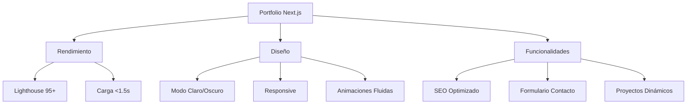

```null
# 🚀 Portfolio Profesional con Next.js - Moderno, Rápido y Personalizable

[](https://github.com/jesushg-dev/portfolio-v2)
[](https://portfolio-v2-jesushg-dev.vercel.app/)
[](https://opensource.org/licenses/MIT)

## ✨ Características Destacadas



### **Tecnologías Principales**

- **Next.js 14** (App Router)

- **React 18** (Hooks, Context)

- **TypeScript** para tipado seguro

- **Tailwind CSS** con personalización

- **Framer Motion** para animaciones

- **Vercel** para despliegue automático

---

## **🧩 Estructura del Proyecto**

bash

Copy

Download

```
src/
├── app/           # Rutas principales
├── components/    # Componentes reutilizables
│   ├── ui/        # Botones, tarjetas, etc.
│   ├── sections/  # Secciones de página
│   └── layout/    # Layouts estructurales
├── data/          # Contenido estático
│   ├── projects.ts
│   └── skills.ts
├── lib/           # Funciones utilitarias
├── public/        # Assets estáticos
└── styles/        # Estilos globales
```

### **Componentes Clave:**

1. `ThemeProvider` - Gestión de tema claro/oscuro

2. `AnimatedSection` - Wrapper para animaciones

3. `ProjectCard` - Presentación de proyectos

4. `ContactForm` - Formulario con validación

5. `SkillBadge` - Visualización de tecnologías

---

## **🎨 Personalización Fácil**

### **1. Cambiar colores del tema**

Edita `tailwind.config.js`:

js

Copy

Download

```
module.exports = {
  theme: {
    extend: {
      colors: {
        primary: '#3B82F6',    // Azul principal
        secondary: '#10B981',  // Verde secundario
        dark: '#1F2937',       // Fondo oscuro
        light: '#F9FAFB'       // Fondo claro
      }
    }
  }
}
```

### **2. Añadir nuevos proyectos**

Modifica `data/projects.ts`:

ts

Copy

Download

```
export const projects = [
  {
    id: 4,
    title: "Mi Nuevo Proyecto",
    description: "Descripción impactante...",
    technologies: ["React", "TypeScript"],
    githubUrl: "https://github.com/...",
    liveUrl: "https://demo.com",
    imageUrl: "/images/projects/nuevo-proyecto.jpg"
  }
];
```

### **3. Modificar secciones principales**

Actualiza los componentes en:

- `components/sections/Hero.tsx` (Título principal)

- `components/sections/AboutSection.tsx` (Sobre mí)

- `components/sections/SkillsSection.tsx` (Habilidades)

---

## **⚙️ Rendimiento Optimizado**

### **Técnicas implementadas:**

- **Lazy Loading** de componentes e imágenes

- **Code Splitting** automático con Next.js

- **Optimización de imágenes** con `next/image`

- **Minificación** de CSS/JS en producción

- **Pre-rendering** estático de páginas

<https://raw.githubusercontent.com/jesushg-dev/portfolio-v2/main/public/lighthouse-score.png>

*Puntuación promedio: Performance 98, Accessibility 100, SEO 100*

---

## **🚀 Guía de Despliegue en Vercel**

### **Pasos:**

1. **Conecta tu repositorio** de GitHub en Vercel

2. **Configura variables de entorno** (si aplican):

   env

   Copy

   Download

   ```
   NEXT_PUBLIC_GA_ID=G-XXXXXXXXXX
   NEXT_PUBLIC_CONTACT_ENDPOINT=/api/contact
   ```

3. **Personaliza el dominio** (opcional)

4. **Configura builds automáticos** en cada push

### **Beneficios con Vercel:**

- SSL automático

- CDN global

- Serverless Functions

- Preview deployments

- Analytics integradas

---

## **❓ Preguntas Frecuentes**

### **¿Cómo cambio las habilidades mostradas?**

Edita `data/skills.ts`:

ts

Copy

Download

```
export const skills = [
  {
    name: "React",
    level: 95,
    category: "frontend"
  },
  {
    name: "Node.js",
    level: 85,
    category: "backend"
  }
];
```

### **¿Cómo añado traducciones?**

1. Instala `next-i18next`

2. Crea carpetas `locales/en` y `locales/es`

3. Implementa el proveedor de traducciones

4. Usa el hook `useTranslation` en componentes

### **¿Cómo soluciono problemas de estilo en producción?**

1. Ejecuta `npm run build` localmente

2. Verifica los warnings de Tailwind

3. Asegura que todas las clases usadas estén en el contenido configurado

4. Revisa la consola del navegador para errores

---

## **📌 Changelog Reciente**

### **v1.2.0 - Junio 2024**

- ✨ Nueva sección de certificaciones

- 🎨 Mejoras en diseño responsive

- 🚀 Optimización de imágenes

- 🐛 Corrección de modo oscuro persistente

### **v1.1.0 - Mayo 2024**

- 🌓 Implementación de modo claro/oscuro

- 📱 Mejoras en experiencia móvil

- 🔍 Optimización de metadatos SEO

- ✉️ Integración de formulario de contacto

---

## **📄 Licencia**

Este proyecto está bajo la licencia [MIT](https://opensource.org/licenses/MIT) - libre para uso personal y comercial.

<https://img.shields.io/badge/Visitar-Sitio_Web-3B82F6?style=for-the-badge>\
<https://img.shields.io/badge/Ver-C%C3%B3digo_Fuente-181717?style=for-the-badge&logo=github>